<div align="center">
  
# 👨‍💻 Abbosov Muhammadjon


[](https://amity-ifs.vercel.app)
[](https://www.linkedin.com/in/abbosovm/)
[](https://t.me/abbosovmm)
[](https://www.instagram.com/_abbosov1_/)


</div>

---

## 👨‍💻 About Me

> *"Code today, change tomorrow"*

**Junior Python Backend Developer** specializing in **API Development** and **Telegram Bot Creation**

🎓 Currently studying **International Foundation Studies** at **Amity University Tashkent** (Cyber Security pathway)

💼 Practical experience building production-ready APIs with **Django** and **FastAPI**

🤖 Former Telegram Bot Developer at **S-Orca** (December 2024 - March 2025)

🌱 Actively learning **AI & Machine Learning** for future innovations

🚀 **Vision:** Founder of **AbM Academy** - providing quality IT education with guaranteed employment

```python
class Developer:
    def __init__(self):
        self.name = "Abbosov Muhammadjon"
        self.role = "Junior Python Backend Developer"
        self.location = "Tashkent, Uzbekistan 🇺🇿"
        self.education = "Amity University Tashkent (IFS - Cyber Security)"
        
    def specialization(self):
        return {
            "backend": ["Django", "FastAPI", "REST APIs"],
            "bots": ["Telegram Bots", "Aiogram", "Automation"],
            "databases": ["PostgreSQL", "SQL"],
            "devops": ["Docker", "AWS"]
        }
    
    def current_status(self):
        return {
            "year": 2026,
            "focus": ["AI & Machine Learning", "System Design", "Cloud Architecture"],
            "working_on": "IFS Student Portal & AI Projects",
            "goal": "Building AbM Academy for next generation"
        }

developer = Developer()
print(developer.current_status())
```

### 🎯 Key Highlights

<table>
<tr>
<td width="50%">

#### 💻 Technical Expertise
- ✅ Production-ready API development
- ✅ Telegram bot automation
- ✅ Database design & optimization
- ✅ Cloud deployment (AWS, Vercel)

</td>
<td width="50%">

#### 🚀 Professional Experience
- ✅ S-Orca: Bot Developer (3+ months)
- ✅ IFS Portal: Lead Developer
- ✅ 200+ students impacted
- ✅ Multiple production deployments

</td>
</tr>
</table>

---

## 🚀 Featured Projects

### 🎓 [IFS Student Portal](https://amity-ifs.vercel.app/) ⭐
> *Comprehensive web platform for IFS students at Amity University Tashkent*

**Live Demo:** [amity-ifs.vercel.app](https://amity-ifs.vercel.app/) | **Year:** 2026

<details>
<summary><b>📋 Project Details</b></summary>

```yaml
Tech Stack:
  Backend: React/Node.js
  Database: MongoDB
  Frontend: Typescript, JavaScript, Tailwind
  Deployment: Vercel
  
Key Features:
  ✅ Student Management System
  ✅ Academic Resources Hub
  ✅ Course Information & Schedules
  ✅ Interactive Dashboard
  ✅ Responsive Design
  ✅ Real-time Updates

Impact:
  👥 200+ Active Students
  📚 Centralized Resource Access
  ⚡ Improved Communication
  📈 Enhanced Academic Experience
```

**Role:** Lead Developer  
**Responsibilities:**
- Full-stack development from concept to deployment
- Database architecture and optimization
- User interface design and implementation
- Integration with university systems
- Ongoing maintenance and feature updates

</details>

---

### 🤖 Telegram Bot Solutions @ S-Orca
> *Professional bot development for business automation*

**Period:** December 2024 - March 2025 | **Company:** [S-Orca](https://s-orca.uz)

<details>
<summary><b>📋 Work Experience Details</b></summary>

```python
# Professional Bot Development Portfolio

projects = {
    "business_automation": {
        "description": "Client management & automated notifications",
        "tech": ["Aiogram", "PostgreSQL", "REST APIs"],
        "scale": "1000+ daily interactions"
    },
    "data_collection": {
        "description": "User surveys & feedback systems",
        "features": ["Multi-step forms", "Data validation", "Analytics"],
        "impact": "Improved data accuracy by 40%"
    },
    "customer_support": {
        "description": "24/7 automated assistance",
        "capabilities": ["FAQ automation", "Ticket routing", "Response templates"],
        "result": "Reduced response time by 60%"
    }
}

achievements = [
    "Built 5+ production-ready bots",
    "Implemented payment integrations",
    "Optimized for high-load scenarios",
    "Maintained 99.9% uptime"
]
```

**Technologies:** Aiogram, Python Async, Webhooks, Database Integration, API Development

**Key Achievements:**
- ⚡ Developed efficient async bots handling 1000+ daily interactions
- 🔄 Integrated payment systems and external APIs
- 📊 Implemented comprehensive analytics and user tracking
- 🛡️ Ensured secure data handling and privacy compliance
- 🎯 Delivered projects on time with 100% client satisfaction

</details>

---

## 💼 Professional Experience

```mermaid
timeline
    title Career Journey
    2023-2024 : Professional Training at Billion Innovations 🎓
              : Kokand, Uzbekistan
              : Advanced Programming & Development
    Dec 2024 - Mar 2025 : Telegram Bot Developer @ S-Orca 🤖
                        : Production Bot Development
                        : Business Automation Solutions
    2026 : IFS Student Portal - Lead Developer 🌐
         : Full-Stack Web Development
         : Serving 200+ Students
    2026 : Current: Practical Training & AI/ML 💻
         : Expanding Skills in Artificial Intelligence
         : Contributing to Open Source
    2027-2028 : Future: AbM Academy Founder 🏢
              : Quality IT Education for All
              : Empowering Next Generation
```



### 📋 Detailed Work History

#### **Telegram Bot Developer** | [S-Orca](https://s-orca.uz)
*December 2024 - March 2025* (3 months)

- 🤖 Developed and deployed 5+ production-ready Telegram bots
- 📈 Improved user engagement through intelligent automation
- 🔧 Maintained and optimized existing bot infrastructure
- 👥 Collaborated with cross-functional teams
- 💡 Proposed and implemented innovative solutions

**Key Projects:**
- Business automation bot with CRM integration
- Customer support bot with AI-powered responses
- Data collection and survey automation system

---

#### **Lead Developer** | IFS Student Portal
*2026 - Present*

- 🌐 Full-stack development of web platform for university students
- 📊 Managing project timeline and deliverables
- 🎨 UI/UX design and implementation
- 🔄 Continuous integration and deployment
- 📚 Documentation and user support

---

#### **Practical Training** | Self-Directed Learning
*2026 - Present*

- 🎯 Focusing on advanced backend architecture
- 🧠 Deep diving into AI & Machine Learning
- 🌐 Contributing to open-source projects
- 📖 Following industry best practices
- 🚀 Building portfolio projects

---

## 🎓 Education & Certifications

<table>
<tr>
<td width="50%">

### 🎓 University Education

**Amity University Tashkent**
- Program: **International Foundation Studies (IFS)**
- Pathway: **Cyber Security**
- Status: Currently Enrolled (2026)
- Focus Areas:
  - Backend Development
  - Network Security
  - Database Systems
  - Cloud Computing

</td>
<td width="50%">

### 📜 Professional Training

**Billion Innovations**
- Period: **2023-2024**
- Location: Kokand, Uzbekistan
- Website: [innovations.uz](https://innovations.uz/)
- Completed: Advanced Programming Course
- Skills Acquired:
  - Python Development
  - Web Technologies
  - Database Management
  - Software Engineering

</td>
</tr>
</table>

---

## 🛠️ Technical Skills

### Backend Development


### Bot Development


### Databases & DevOps


### Frontend & Design


### Other Tools & Frameworks


---

## 📊 GitHub Analytics

<p align="center">
  
  
</p>

<p align="center">
  
</p>

<p align="center">
  
</p>

---

## 🎯 Learning Roadmap


### 🚀 Current Focus (2026)
- 🤖 **Artificial Intelligence & Machine Learning**
  - Neural Networks & Deep Learning
  - Natural Language Processing
  - Computer Vision Applications
  
- ☁️ **Cloud Native Development**
  - AWS Solutions Architecture
  - Kubernetes & Container Orchestration
  - Serverless Architecture
  
- 🏗️ **Advanced System Design**
  - Microservices Architecture
  - Scalability Patterns
  - Performance Optimization
  
- 🔐 **Cybersecurity Enhancement**
  - Application Security
  - Secure Coding Practices
  - Threat Detection & Prevention

### 📚 Learning Path 2026-2028
1. ✅ Master AI/ML fundamentals (2026)
2. 🔄 Build AI-powered applications (2026-2027)
3. 📊 Contribute to open-source ML projects (2026-2027)
4. 🎓 Develop AbM Academy curriculum (2027)
5. 🚀 Launch AbM Academy (2028)

---

## 🏆 Vision: AbM Academy

<div align="center">

### 🎓 **Building the Future of IT Education in Uzbekistan**

```ascii
╔══════════════════════════════════════════════════════════╗
║                      AbM Academy                         ║
║     "Quality Education. Real Opportunities. Impact"      ║
╚══════════════════════════════════════════════════════════╝
```

</div>

#### 💡 Mission Statement

Creating a **world-class IT academy** that transforms lives through education and guaranteed employment opportunities.

<table>
<tr>
<td width="50%">

### ✅ Quality Education
- Industry-relevant curriculum
- Hands-on project experience
- Mentorship from professionals
- Real-world problem solving
- Cutting-edge technologies

</td>
<td width="50%">

### 🎯 Equal Opportunities
- **FREE education for talented students**
- Merit-based scholarships
- No financial barriers for achievers
- Focus on skill, not background
- Support for underprivileged talent

</td>
</tr>
<tr>
<td width="50%">

### 💼 Guaranteed Employment
- Direct job placement after graduation
- Partnership with leading tech companies
- Portfolio building from day one
- Career guidance and support
- Industry networking opportunities

</td>
<td width="50%">

### 🌍 Community Impact
- Building Uzbekistan's tech ecosystem
- Creating local tech talent
- Reducing brain drain
- Inspiring next generation
- Contributing to national development

</td>
</tr>
</table>

---

#### 🎯 Why AbM Academy?

> *"Everyone deserves a chance to learn and grow. Talent shouldn't be limited by financial constraints."*

After experiencing the challenges of self-learning and witnessing talented individuals struggle due to lack of resources, I'm committed to creating an academy that:

- 🌟 **Identifies and nurtures talent** regardless of background
- 💪 **Provides intensive, practical training** with real projects
- 🚀 **Guarantees employment opportunities** through industry partnerships
- 🤝 **Builds a supportive tech community** for continuous growth
- 📈 **Focuses on outcomes** - student success is our success

#### 📅 Strategic Roadmap to AbM Academy

```
Phase 1 (2026-2027): Foundation & Experience Building
├── 📊 Gain 2+ years professional experience in industry
├── 💼 Build comprehensive portfolio of successful projects
├── 🤝 Network with industry leaders and potential partners
├── 💰 Accumulate initial capital for academy launch
└── 📚 Research best educational practices and methodologies

Phase 2 (2027-2028): Planning & Infrastructure
├── 📖 Develop comprehensive, industry-aligned curriculum
├── 🏢 Partner with companies for guaranteed job placement
├── 🏛️ Secure physical location and learning resources
├── 👨‍🏫 Assemble team of experienced instructors
└── 💻 Set up technical infrastructure and labs

Phase 3 (2028-2029): Launch & Initial Operations
├── 🎓 Accept and onboard first batch of students (30-50)
├── 📚 Deliver high-quality, intensive training program
├── 👨‍💼 Successfully place graduates in quality tech positions
├── 📈 Collect feedback and iterate on curriculum
└── 🏆 Establish reputation for excellence

Phase 4 (2029+): Scale & Long-term Impact
├── 📍 Expand to multiple locations across Uzbekistan
├── 🆓 Increase free student quota for talented individuals
├── 🎯 Create specialized advanced programs (AI, Security, etc.)
├── 🌐 Establish partnerships with international institutions
└── 🏅 Become regional leader in IT education excellence
```

**Current Status (2026):** Phase 1 in progress
- ✅ Gaining industry experience
- ✅ Building professional network
- 🔄 Creating portfolio projects
- 🔄 Accumulating resources

---

## 🌟 What Sets Me Apart

<table>
<tr>
<td width="50%">

### 💻 Technical Excellence
- Clean, maintainable, well-documented code
- Performance optimization mindset
- Security-first development approach
- Continuous learning and improvement
- Best practices and design patterns

</td>
<td width="50%">

### 🎯 Problem Solver
- Real-world project experience
- User-centric solution approach
- Quick learner and adapter
- Creative thinking for complex challenges
- Data-driven decision making

</td>
</tr>
<tr>
<td width="50%">

### 🤝 Team Player
- Clear and effective communication
- Collaborative mindset and approach
- Active knowledge sharing
- Mentoring and helping others
- Contributing to team success

</td>
<td width="50%">

### 🚀 Visionary Mindset
- Long-term strategic thinking
- Strong social impact focus
- Building for sustainable future
- Community-oriented approach
- Leading positive change

</td>
</tr>
</table>

---

## 📈 Current Status (2026)

```python
current_status = {
    "💼 Position": "Practical Training & Open for Opportunities",
    "📚 Learning": "AI/ML, Advanced System Design, Cloud Architecture",
    "🎯 2027 Goal": "Secure Senior Backend Developer Position",
    "🌟 2028 Dream": "Launch AbM Academy - Change Lives Through Education",
    "💪 Philosophy": "Code with purpose, build with passion, teach with heart",
    "🔥 Available For": [
        "Backend Development Roles",
        "Bot Development Projects",
        "Freelance Opportunities",
        "Open Source Contributions",
        "Technical Collaborations"
    ]
}
```

### 🎯 Goals for 2026-2027

- [ ] Master AI & Machine Learning fundamentals and applications
- [ ] Contribute to 5+ significant open-source projects
- [ ] Build and deploy 3 production-ready AI-powered applications
- [ ] Secure full-time backend developer position in established company
- [ ] Begin concrete planning and networking for AbM Academy
- [ ] Reach 1000+ GitHub contributions and maintain consistency
- [ ] Obtain relevant technical certifications (AWS, ML)
- [ ] Build professional network in tech industry

---

## 📫 Let's Connect!

<div align="center">

### 💬 I'm Open To:

```
✅ Backend Development Opportunities (Junior/Mid-level)
✅ Bot Development Projects & Automation
✅ Collaboration on Open Source Projects
✅ Technical Discussions & Knowledge Exchange
✅ Mentorship & Teaching Opportunities
✅ Partnership for AbM Academy Initiative
✅ Freelance & Contract Work
```

<br>

[](https://www.linkedin.com/in/abbosovm/)
[](https://t.me/abbosovmm)
[](https://www.instagram.com/_abbosov1_/)
[](https://amity-ifs.vercel.app)

<br>

### 📧 Professional Contact
**Email:** muhammadjon5183@gmail.com

</div>

---

<div align="center">

### ⚡ Developer Insights

```python
developer_facts = {
    "☕": "Coffee-driven developer - Best code at 2 AM",
    "🌙": "Night owl coder - When the world sleeps, I build",
    "🎯": "Love solving complex algorithmic problems",
    "📚": "Always learning - Tech never stops evolving",
    "🤖": "Bot automation enthusiast - Automate everything!",
    "🌍": "Dream: Make quality IT education accessible to all",
    "💡": "Believe in: Hard work + Smart work = Success",
    "🚀": "Mission: Build products that matter and change lives"
}

# Random fact of the day
import random
print(random.choice(list(developer_facts.values())))
```

</div>

---

<div align="center">


### 💫 "Building today, empowering tomorrow, changing lives forever"

[](https://github.com/abbosov1)

⭐️ **If you like my work or vision, consider giving a star to my projects!** ⭐️

<sub>Last Updated: February 2026 | Built with dedication and vision for the future</sub>

</div>
